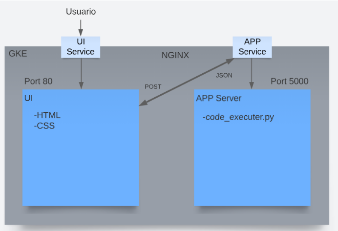
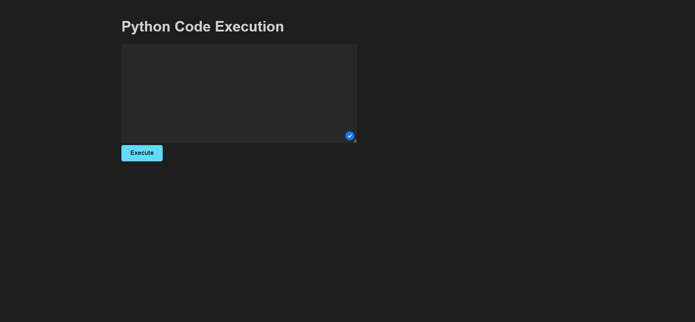
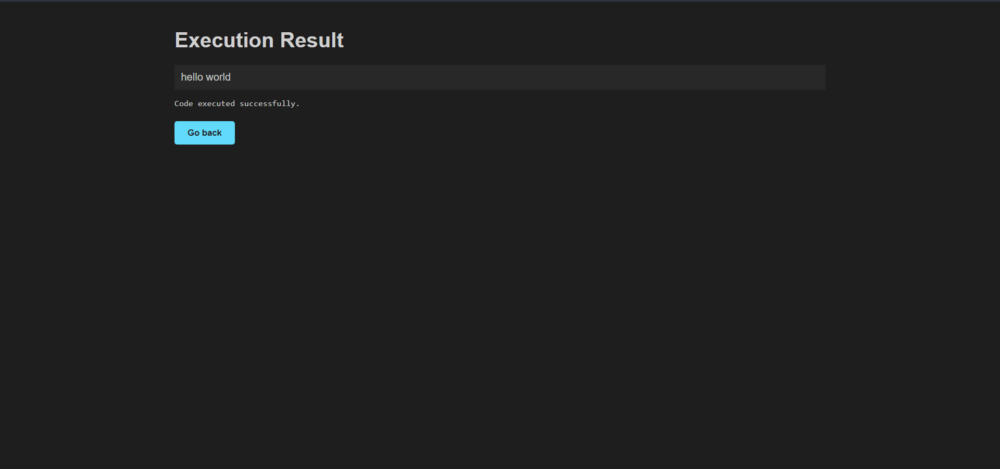

# Proyecto Final de Cloud Computing
## Integrantes
- José Miguel Guzmán Chauca
- Fabrizio Paul Rosado Málaga

## Introducción
El proyecto consiste en utilizar las herramientas de Cloud Computing para crear un servicio de ejecución de código similar al provisto por Replit. Este servicio permite al usuario ingresar su código para ser evaluado y ejecutado, mostrando la salida resultante de la evaluación.

Utilizando los conocimientos adquiridos en el curso, creamos nuestra propia versión del servicio utilizando las siguientes herramientas: Google Cloud Processing (GCP), HTML, CSS, Python, NGINX, JavaScript, Kubernetes y Docker.

## Estructura del Proyecto
El proyecto se basa en la creación de un clúster en Google Kubernetes Engine (GKE), donde se generan imágenes para la interfaz de usuario y el servidor según las indicaciones iniciales. A continuación, se muestra un gráfico con los componentes del proyecto.



El usuario se conecta al servicio a través de la interfaz, la cual utiliza un balanceador de carga para garantizar su disponibilidad y elasticidad. Dentro del clúster se encuentran los contenedores y los pods necesarios para la virtualización de los archivos del proyecto.

El contenedor UI escucha en el puerto 80 y se comunica con el balanceador de carga para recibir el código del usuario. Luego, mediante el método POST y utilizando NGINX, se comunica con el servicio de la aplicación.

El contenedor de la aplicación ejecuta el código y devuelve la salida al servicio UI a través de NGINX en formato JSON.

Adicionalmente, el clúster GKE cuenta con un Horizontal Pods Autoscaling, encargado de ajustar automáticamente el número de pods disponibles según las métricas establecidas, en este caso utilizando el porcentaje de uso de la CPU de las instancias. Este proceso se realiza en cada despliegue.

Finalmente, el servicio UI muestra la salida del código, indicando si se ejecutó correctamente o si hubo algún problema durante la ejecución.

## Resultados Obtenidos
El proyecto ha logrado cumplir con su objetivo. Para utilizar la funcionalidad de ingresar código, es necesario acceder a la dirección proporcionada por GCP: [http://34.139.106.232/](http://34.139.106.232/). Una vez allí, se mostrará la interfaz de entrada, como se muestra en la siguiente imagen:



Después de ingresar el código en el formulario y hacer clic en el botón "Execute", se redirigirá a la siguiente interfaz, donde se mostrará la salida y el resultado de la ejecución.



## Prueba de estrés del Proyecto
ApacheBench proporciona estadísticas sobre las solicitudes realizadas, incluyendo el número de solicitudes por segundo, el tiempo de respuesta promedio y más. Estos resultados nos ayudan a evaluar el rendimiento y el comportamiento del escalado automático del endpoint.

```
Server Software: nginx/1.21.6
Server Hostname: 34.139.106.232
Server Port: 80
Document Path: /
Document Length: 490 bytes
Concurrency Level: 1000
Time taken for tests: 95.948 seconds
Complete requests: 10000
Failed requests: 21
(Connect: 0, Receive: 0, Length: 21, Exceptions: 0)
Total transferred: 7218432 bytes
HTML transferred: 4892160 bytes
Requests per second: 104.22 [#/sec] (mean)
Time per request: 9594.801 [ms] (mean)
Time per request: 9.595 [ms] (mean, across all concurrent requests)
Transfer rate: 73.47 [Kbytes/sec] received
Connection Times (ms)
    min  mean[+/-sd] median   max
Connect:        0   1683 2349.0   1096   32769
Processing:   123   1745 3264.2    914   63091
Waiting:      123   1072 1471.6    696   25659
Total:        267   3427 4053.4   2174   63091
Percentage of the requests served within a certain time (ms)
  50%   2174
  66%   2684
   75%   4019
   80%   4804
   90%   6785
   95%   9449
   98%  15510
   99%  17988
  100%  63091 (longest request)
```

Estas estadísticas nos permiten evaluar la capacidad de respuesta de nuestro endpoint bajo una carga de 1000 solicitudes concurrentes. Podemos observar que durante la prueba se realizaron un total de 10000 solicitudes, de las cuales 21 fallaron. El tiempo promedio por solicitud fue de 9.595 ms, y el servidor fue capaz de atender aproximadamente 104.22 solicitudes por segundo.

Además, los tiempos de conexión y procesamiento se encuentran dentro de un rango aceptable, con una mediana de 1096 ms para la conexión y 914 ms para el procesamiento. También podemos observar que el porcentaje de solicitudes atendidas en un tiempo determinado sigue una distribución gradual, siendo la solicitud más larga de 63091 ms.

Estos resultados nos ayudan a evaluar la capacidad de nuestro proyecto para manejar una carga de solicitudes y nos permiten tomar decisiones sobre el escalado automático del endpoint en función del rendimiento obtenido durante la prueba de estrés.

## Instrucciones para Replicar el Proyecto
-Descargar los archivos del repositorio.
-Crear un clúster GKE en GCP.
-Descargar e instalar Docker.
-Descargar la API de Google Cloud.
-Configurar Docker y conectarlo al clúster de GKE.
-Realizar las configuraciones necesarias en los archivos.
-Subir los archivos modificados a Docker.
-Realizar el despliegue del proyecto utilizando los comandos de Kubernetes.

## Repositorio
En el siguiente enlace se puede acceder al repositorio que contiene los archivos necesarios para poder ejecutar el proyecto:

https://github.com/FPRM2021/Cloud-Python-App
